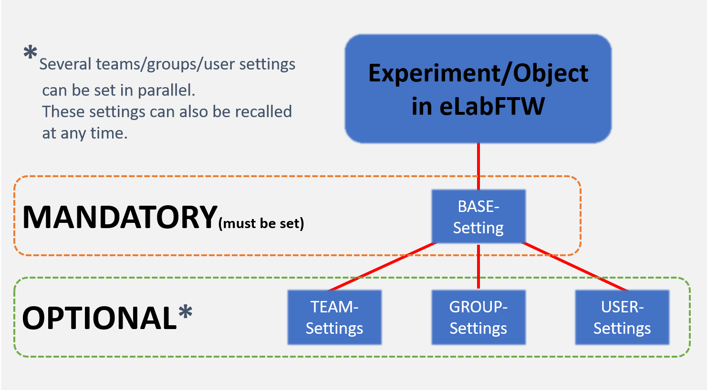
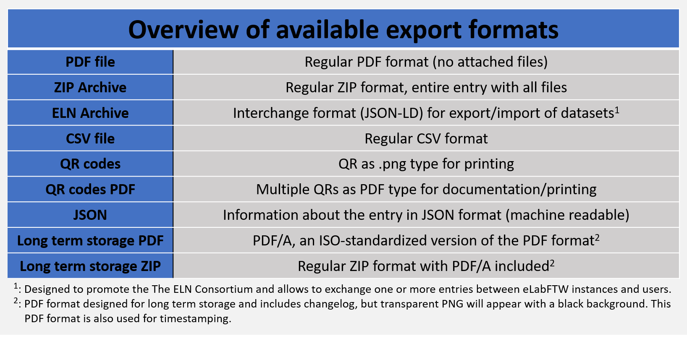
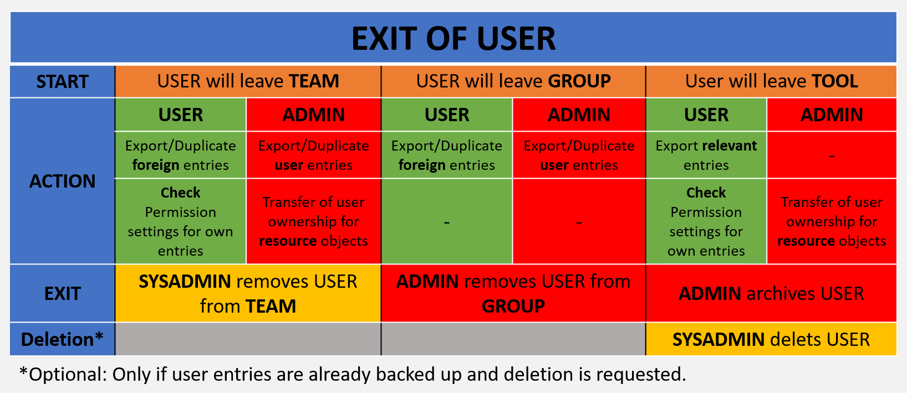

eLabFTW is an electronic solution to the classic lab notebook and offers many additional practical features (schedular, collaborative working, lab equipment management, etc.). It is an open source solution that is already in use at many research institutions worldwide.

The page is intended to provide support for the use of eLabFTW. You will find manuals for users and admins of teams in eLabFTW. You will also find a list of frequently asked questions. If you have a question or request about eLabFTW (e.g. create a team or add a user) please contact the SysAdmin.

## Table of contents
1. [Manuals](#manuals)
2. [API Tutorial](#api_tutorial)
3. [Overview of permissions management in eLabFTW](#overview_permissions)
4. [Export of entries](#export_entries)
5. [Tip: Leaving a team/group or the tool](#leaving_user)
6. [Backup options for users](#backup_user)
7. [Contact](#contact)

## Manuals 

1. [User Guide](https://github.com/alexgu2008/elabftw_support_unigraz/blob/main/eLabFTW_BioHealth_Guide_User_en_v2.1.pdf) [New User Guide (valid from 28.08.2025)](https://github.com/alexgu2008/elabftw_support_unigraz/blob/main/eLabFTW_BioHealth_Guide_User_en_v3.0.pdf)
2. [Team Admin Guide](https://github.com/alexgu2008/elabftw_support_unigraz/blob/main/eLabFTW_BioHealth_Guide_TeamAdmin_en_v2.1.pdf) [New Team Admin Guide (valid from 28.08.2025)](https://github.com/alexgu2008/elabftw_support_unigraz/blob/main/eLabFTW_BioHealth_Guide_TeamAdmin_en_v3.0.pdf)

## API Tutorial 

[eLabFTW API Support Page](https://alexgu2008.github.io/elabftw_api_support_unigraz/)

## FAQ

> **Who is allowed to use eLabFTW?**
> 
> The eLabFTW ELN was established at Uni Graz by an initiative from the Field of Excellence BioHealth. Currently all Uni Graz staff and students having an active Uni Graz e-mail address are allowed to use the instance. If you are also interested in using it as part of a cooperation, please contact your cooperation partner at UNI Graz.

> **How can I join a specific team?**
> 
> You can select the team you want when you register. If you want to change teams afterwards, please contact the team admin or the SysAdmin.

> **Can I have diffenrnet roles (User, Admin) in different teams?**
> 
> Yes, depending on the team, you can be either a regular user or a team admin.

> **Is it possible to use edits on a shared experiment by highlighting the different users in colour?**
> 
> For the text editor, you can agree in advance on a font color per user and thus keep track. A change tracking like Word is not possible at the moment. All other changes can be tracked via the changelog (depending on the minimum number of characters).

> **Do I need additional software on my device?**
> 
> Not really, but you need a browser like Chrome or Firefox or similar and an active internet connection.

> **Do I need a VPN connection?**
> 
> No, you do not have to be directly in the UNI Graz network to use the e-lab notebook.

> **Why is the upload limit for attachments 100 MB?**
> 
> At UNI Graz, eLabFTW is not a data repository for large amounts of data. The e-lab notebook is used to document all imaginable metadata that are part of the research. These are usually smaller than 100 MB.

> **Where is the data located and is it secure?**
> 
> The data is stored on the servers of the IT services of UNI Graz and is protected by their security measures.

> **Can I link files from my local hard drives?**
> 
> In principle you can get the local file path from any folder and then save it e.g. in eLabFTW in the editor section. This would again work like a link, but eLabFTW is not a local application and therefore the file explorer is not opened directly (because currently addresses that are not web addresses are filtered out). 
Whenever needed, you can copy the saved address and paste it in the file explorer again and so indirectly create a connection. So it is enough to save the file path as text element in eLabFTW.

> **Can I change "Experiments" entries to "Resources" entries?**
> 
> Not directly, neither in the one nor in the other direction. But you can export the corresponding entry as .eln format and then import it via the "Import via file" function at the other section. This way you can transfer an experiment object to a resource object and vice versa.

> **As the admin of a team, can I backup/export the whole team at once?**
> 
> No. There is no separate function which would take over this task explicitly, but you can sort in the experiment or resource overview and select all entries with "Select All" and then export them at the same time.

## Overview of permissions management in eLabFTW 

Configuration options are identical for viewing and writing permissions. Entries always have permission settings that are anchored in the base settings. these are taken from the personal default settings or from template settings, but can be changed. Adding one or more teams, team groups or individual users is optional and can, but does not have to be done. Exception: Admin has forced the use of certain permission settings in the team settings.

## Export of entries 
Depending on the section in eLabFTW, different export formats are available for one or more entries. This allows you to use your documentation externally or, for example, as additional information for publications or audits. Below you will find an overview of the available export formats and a short description.

## Tip: Leaving a team/group or the tool 

When a user leaves a team, a group or the entire tool, it makes sense to have an offboarding strategy in place beforehand. In the three cases mentioned above, there are a few important points to consider when dealing with eLabFTW. As a user, it is important to remember which entries do not belong to you but you want to keep the information. As an admin or other user of the team, it is also important to think about this point in relation to the entries of the departing user. Entries can be duplicated for further use or exported for external archiving. If you leave the tool as a user, you should always export relevant entries, as you will lose access to them. If you are also the owner of resource entries, transfer ownership to the admin of your team. Please remember, if you copy other people's entries, to ask the owner for permission first, as it is the intellectual property of the person concerned. 

## Backup options for users 

If you want to save your entries from eLabFTW externally, i.e. on your computer or on another storage medium, this is possible in different ways. We distinguish here between entries in experiments and in resources.

* **Experiments**

  * You can select one or more entries via the web interface and export them directly. Several formats are        available, which can be selected depending on the application. The entry itself remains after the export.     You can also export an entry via the view of an individual entry. Depending on the view, you have             different formats available for export. First check which one you need before exporting the entry(s).
  * You can export all your experiments in one go via your "Profile". This is possible in different formats.      However, only experiments for which you are the owner can be exported.

  * *Option for admins: As an admin, you can perform all experiments of a user in different formats via the       Admin Panel. You can also export database objects and bookings in the calendar here.*

  * *Option via API: Coming soon (only timestamped entries)*

* **Resources**

  * You can select one or more entries via the web interface and export them directly. Again, several formats     are available, which can be selected depending on the application. The entry itself remains after the         export. You can also export an entry via the view of an individual entry. Depending on the view, you have     different formats available for export. First check which one you need before exporting the entry(s).

## Contact 

*SysAdmin:* *Alexander* *Bardel* 
<alexander.bardel@tugraz.at> 
